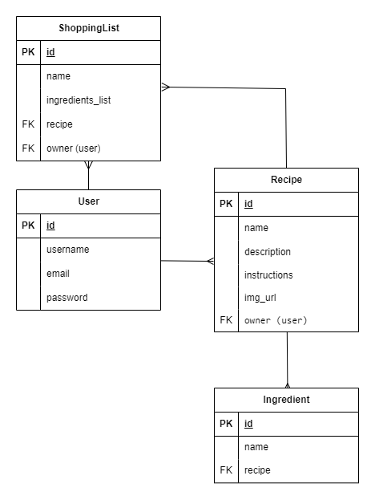

# OneBowl - Backend
## Project Description
OneBowl is a full-stack web application built with React and Django that helps home cooks organize and manage their favorite recipes. Users can create, store, and edit recipes with detailed ingredient lists and step by step cooking instructions. The app also includes a shopping list feature, allowing users to create, view, update, and delete shopping lists based on their selected recipes. OneBowl serves as all in one digital recipe organizer.

## Repository Description
This repository contains the backend code for the OneBowl app. It includes the Django project, RESTful API endpoints, models, serializers, views, and authentication logic.

## Technologies
* Python
* Django 
* Django REST Framework
* PostgreSQL
* Token Based Authentication (JWT)

## Frontend Repository
[OneBowl - Frontend Repo](https://git.generalassemb.ly/reema1radi/oneBowl-project-frontend)

## ERD diagram


This is the Entity Relationship Diagram (ERD) of my app. It describes the models and the relationships between them

## Routing Table
### Frontend
|  URL   | Description |
| ----------- | ----------- |
| / | Homepage |
| /signup | User signup form |
| /login | User login form |
| /logout | Log the user out|
| /recipes | List all recipes |
| /recipes/new | Create a new recipe |
| /recipes/:id | View the details of a specific recipe |
| /recipes/:id/edit | Edit a specific recipe |
| /recipes/:id/delete | Delete a specific recipe |
| /recipes/:id/add-shopping-list | Create a shopping list from a specific recipe |
| /shopping-lists | List all shopping lists |
| /shopping-lists/:id | View the details of a specific shopping list |
| /shopping-lists/:id/edit | Edit a specific shopping list |
| /shoppinglist/:id/delete | Delete a specific shopping list |
| * | Not Found |


### Backend
|  Method     | URL | Description |
| ----------- | ----------- | ----------- |
| POST | /api/signup/ | Sign up a new user |
| POST | /api/token/ | Obtain a JWT token pair |
| POST | /api/token/refresh/ | Refresh the JWT token pair |
| POST | /api/recipes/ | Create a new recipe |
| GET | /api/recipes/ | List all recipes created by the logged in user |
| GET | /api/recipes/id/ | View the details of a specific recipe |
| PATCH | /api/recipes/id/ | Update a specific recipe |
| DELETE | /api/recipes/id/ | Delete a specific recipe |
| GET | /api/ingredients/ | List all recipe ingredients |
| POST | /api/ingredients/ | Create a new ingredient for a recipe |
| DELETE | /api/ingredients/id | Delete a specific ingredient |
| POST | /api/shoppinglist/ | Create a new shopping list |
| GET | /api/shoppinglist/ | List all shopping list of logged in user |
| GET | /api/shoppinglist/id/ |View the details of a specific shopping list |
| PATCH | /api/shoppinglist/id/ | Update a specific shopping list |
| DELETE | /api/shoppinglist/id/ | Delete a specific shopping list |


## Installation
### 1- Clone backend repository
```bash
git clone https://git.generalassemb.ly/reema1radi/oneBowl-project-backend.git
```
### 2- Navigate to backend folder
```bash
cd oneBowl-project-backend
```

### 3- Create and activate virtual environment
```bash
npm pipenv shell
```
### 4- Install dependencies
```bash
pipenv install django djangorestframework psycopg2-binary
```
### 5- Apply migrations
```bash
python manage.py makemigrations
```
```bash
python manage.py migrate
```

### 6- Create supperuser
```bash
python manage.py createsuperuser
```

### 7- Start the server
```bash
python manage.py runserver
```

## IceBox Features
* Recipe and Shopping List export as PDF files
* Public Recipe Sharing
* Ratings System (allow users to rate recipes)
* Recipe Search and Filtering (by ingredients, cuisine...etc.)


